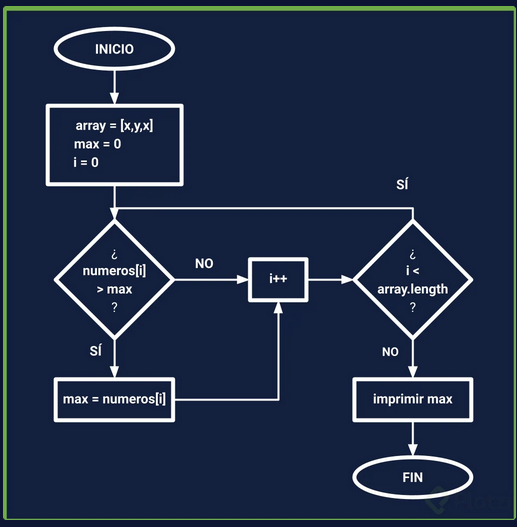

¡Hola, Platzinauta!

El reto de esta clase es que encuentres el número más grande de una lista usando JavaScript.

El algoritmos/ diagrama de flujo es el siguiente:

Diagrama de Flujo Pensamiento Lógico

